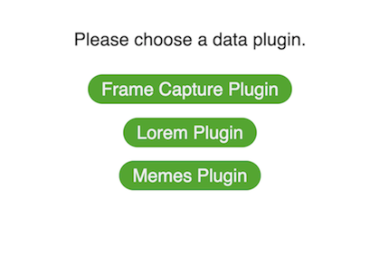
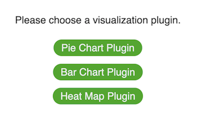
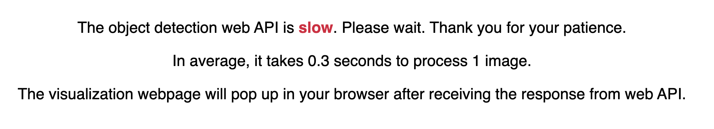
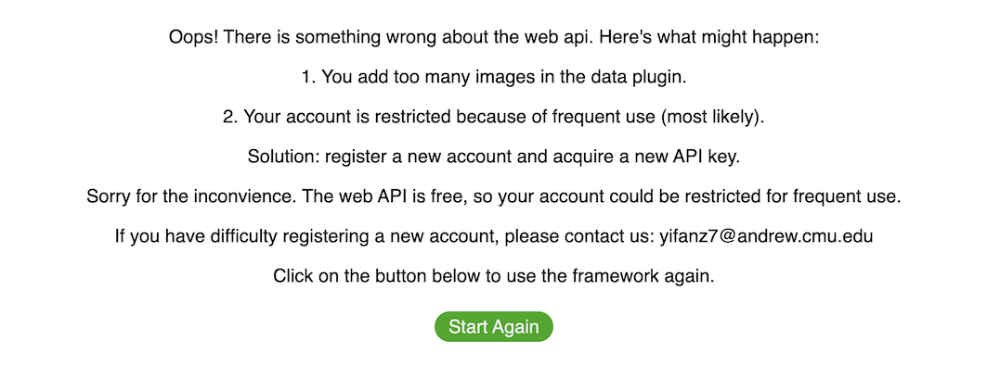
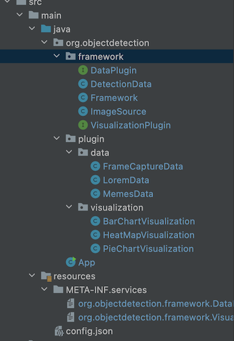
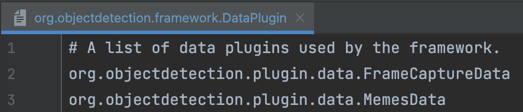
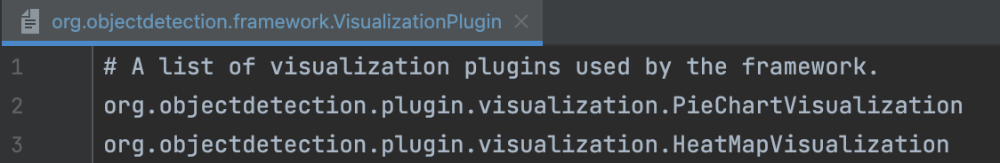
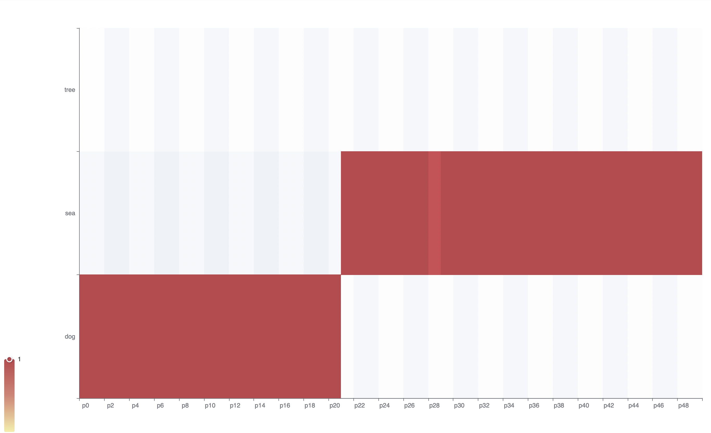
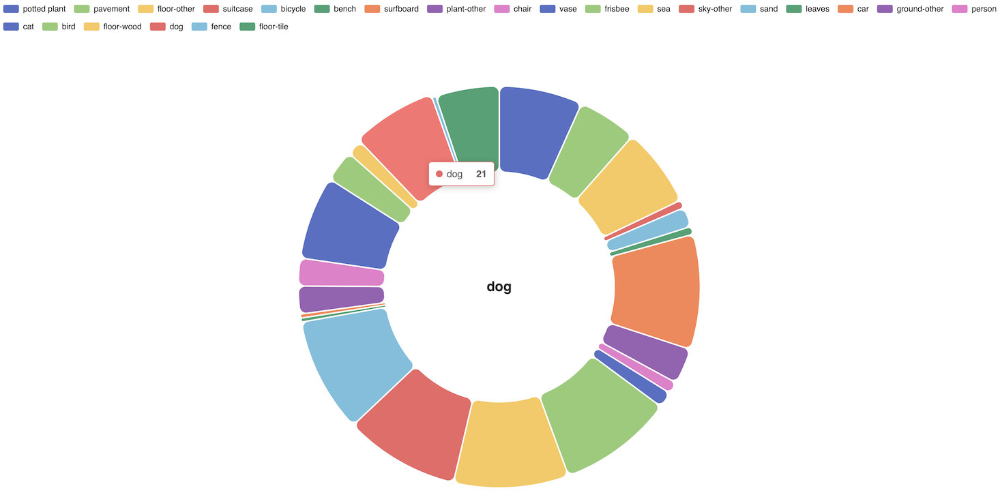

# HW6 Object Detection Framework

- [HW6 Object Detection Framework](#hw6-object-detection-framework)
  - [Description](#description)
  - [How to start](#how-to-start)
    - [Setup instruction](#setup-instruction)
    - [Setup config.json](#setup-configjson)
  - [How to extend](#how-to-extend)
    - [Three Steps to Build Your Own Plugin!](#three-steps-to-build-your-own-plugin)
    - [Project Structure](#project-structure)
    - [Implement Data Plugin](#implement-data-plugin)
    - [Implement Visualization Plugin](#implement-visualization-plugin)
    - [Exchanged Data Structures](#exchanged-data-structures)
      - [Image Source](#image-source)
      - [Detection Data](#detection-data)
    - [config.json](#configjson)
    - [Service Loader](#service-loader)
  - [Data Plugins](#data-plugins)
    - [Frame Capture Data Plugin](#frame-capture-data-plugin)
    - [Memes Data Plugin](#memes-data-plugin)
  - [Visualization Plugins](#visualization-plugins)
    - [Heat Map Visualization](#heat-map-visualization)
    - [Pie Chart Visualization](#pie-chart-visualization)
  - [Interesting Combinations of plugins](#interesting-combinations-of-plugins)
  - [Reference](#reference)

## Description

In this homework, we designed an object detection framework. The purpose of our framework is to detect objects in the pictures from different sources based on machine learning algorithms, which can be reused for different data sources and can provide various kinds of visualization for detection results.

The data plugin of the framework reads a list of images for detection. The visualization plugin visualizes the detection results in HTML format.

Team member:

* Yifan Zhang
* Ruoyu Chen
* Qiujie Wu

## How to start

### Setup instruction

1. Get the API key from [Google Cloud](https://cloud.google.com/vision). You can find detailed instruction below.

   a) Create an account for free. Follow the instruction [here](https://cloud.google.com/vision). You may need to provide the information of your credit card. But it is free. Don't worry about it.

   b) Start a projet and create a new API key. Follow the instruction on [this page](https://cloud.google.com/vision/docs/detect-labels-image-client-libraries).

   c) Generate the JSON format API key and download it into your computer. Export the path of the JSON file as environment variable. Notice that you should export the path of the key every time you open a new terminal.

   d) If you have any difficulty acquiring the API key, you can send an email to [yifanz7@andrew.cmu.edu](mailto:yifanz7@andrew.cmu.edu). We can provide you with an API key.

   **NOTICE:** I found many people have problem with Clarifai web API. Yes, I know it's hard to register and very unstable. So I just switched the web API to Google Cloud. It is more stable than the previous web API. All the interfaces of plugins remain unchanged. It will not have any influence on your current work. If it causes any problem, please open an issue. Sorry for the inconvenience. Here is one simple way to apply this change to your current branch. First, copy your plugins. Then, copy the entire **ObjectDetectionFramework** folder in this repo to replace that folder in your branch. At last, copy the plugins back.

2. In the ObjectDetectionFramework folder, run **mvn site**.

3. In ObjectDetectionFramework folder, run **mvn exec:exec** to start the server.

4. In the frontend folder, run **npm install** to install node modules.

5. In the frontend folder, run **npm start** to start the frontend. The webpage of the framework should be opened at http://localhost:3000.

6. On the frontend webpage, choose one data plugin by clicking on the button.

 

7. Then choose one visualization plugin.

 

8. The framework is running. The frontend should look like the screenshot below. It may take a while because we need to upload images to web API. please be patient :D (On average, it takes 0.3 seconds to process 1 image, the visualization webpage will pop up in your browser after receiving the response from the web API).

    
  
9.  The visualization page should pop up in the browser. the user can press **Start Again** button to use the framework again and repeat step 6. If the visualization page does not pop up, you can find it in **/ObjectDetectionFramework/index.html** and open it manually.

   

10. If the Web API meets some problems, it may show the page like this, the user can press the **Start Again** button and try the framework again. The backend will print the detail of the error. You can check it and see what is going wrong. The frontend webpage also gives some solutions.

   

### Setup config.json 

Users can set the parameters of some plugins by modifying the config file (**/ObjectDetectionFramework/src/main/resources/config.json**) using JSON format.

You can find more details about how to configure corresponding plugins in [Data Plugins](#data-plugins) and [Visualization Plugins](#visualization-plugins) sections.

   

## How to extend

### Three Steps to Build Your Own Plugin!

To extend the framework, you only need to follow the three steps below:

1. Implement the plugin interface and place the plugin in corresponding plugin folder (see [Project Structure](#project-structure) section). See [Implement Data Plugin](#implement-data-plugin) section and [Implement Visualization Plugin](#implement-visualization-plugin) section for more information about plugin interfaces.

2. (optional) If your plugin need any argument, add arguments in config.json (**/ObjectDetectionFramework/src/main/resources/config.json**) and implement the initialize method in the interface to read these arguments. You can find more instructions with a concrete example in [config.json](#configjson) section.

3. Register the plugin to the framework. Add the plugin to **/ObjectDetectionFramework/src/main/resources/META-INF/services**. For more details, see [Service Loader](#Service-Loader) section.

### Project Structure

The project structure of the framework is shown below. Users should place their own plugins in corresponding plugin folder. Data plugins should be in **plugin/data** folder. Visualization plugins should be in **/plugin/visualization** folder.



### Implement Data Plugin

The framework accepts user-defined data plugins. The data plugin reads a list of images from some data source. To implement the user-defined data plugin, the user must implement the **DataPlugin** interface.

```java
public interface DataPlugin {
	/**
	 * Get the name of the plugin.
	 * @return The name of the plugin.
	 */
	String getPluginName();

	/**
	 * Get arguments of the plugin from a json file.
	 * @param args A json object that contains the arguments of the plugin.
	 */
	void initialize(JSONObject args);

	/**
	 * Input images to the plugin to generate dataset for the framework.
	 * @return A dataset of images.
	 */
	ImageSource inputImages();
}
```

The methods of the interface is described below:

1. **getPluginName:** The user should return the name of their plugin in this method.

2. **initialize:** In this method, the user can define how the plugin is initialized. It receives the JSON object of itself defined in config.json. This method allows the plugin to receive arguments set by the user. More detail about config.json and an example of initializing plugin can be found in [config.json](#configjson) section.

3. **inputImages:** The key method of data plugin. The user should extract the urls or the paths of the images in this method and return to the framework. This method should return an ImageSource object, which contains the urls and paths of the input images. The detail of ImageSource class could be found in [ImageSource section](#image-source).


### Implement Visualization Plugin

The framework supports user-defined visualization plugins. Each visualization plugin represents a visualized output that can be rendered by the framework. To implement the user-defined visualization plugin, the user must implement the **VisualizationPlugin** interface.

```java
public interface VisualizationPlugin {
	/**
	 * Get the name of the plugin.
	 * @return The name of the plugin.
	 */
	String getPluginName();

	/**
	 * Get arguments of the plugin from a json file.
	 * @param args A json object that contains the arguments of the plugin.
	 */
	void initialize(JSONObject args);

	/**
	 * Visualize the detection data to a chart.
	 * @param data The detection result of given images.
	 * @return An HTML string represents the generated visualization webpage.
	 */
	String visualizeData(DetectionData data);
}
```

The methods of the interface is described below:

1. **getPluginName:** The user should return the name of their plugin in this method.

2. **initialize:** In this method, the user can define how the plugin is initialized. It receives the JSON object of itself defined in config.json. This method allows the plugin to receive arguments set by the user. More detail about config.json and an example of initializing plugin can be found in [config.json](#configjson) section.

3. **visualizeData:** The key method of visualization plugin. The user should define a way to visualize the result of the object detection in this method (e.g. charts, progress bar, sets of pictures). This method should return the HTML string of the visualization page. This method receives a DetectionData object as argument, which contains the results of detection and many useful util functions. The detail of DetectionData class could be found in [DetectionData section](#detection-data).

### Exchanged Data Structures

We implemented two exchanged data structures to exchange data between plugins and the framework. Data plugins use **ImageSource** class to input images to the framework. The framework uses **DetectionData** class to pass the detection results to visualization plugins.

#### Image Source

**ImageSource** is a data structure to maintain a list of images obtained from data plugins. Users only need to focus on the following methods:

1. **`size()`** method returns the size of the data set.
2. **`addImageByURL(String url)`** method adds an image to input by online URL
3. **`addImageByPath(String path)`** method adds an image to input by local path.

The order of the images in the input is exactly the order they are added. Here is an example to add images to ImageSource.

```java
public ImageSource inputImages() {
    ImageSource source = new ImageSource();
    source.addImageByURL("https://www.fake.com/1.jpg");
    source.addImageByPath("fake_path/3.png");
    source.addImageByURL("https://www.fake.com/2.jpg");
    return source;
}
```

The code above create an ImageSource that contains 3 images. The order of these images is [1.jpg, 3.png, 2.jpg].


#### Detection Data

Visualization plugins can use **DetectionData** class to get the detection result of the image set. The **`getImageNumber()`** method returns the number of images. The **`getDetectionResult(int index)`** method gets the detection result of a specified image. The **`searchObject(String objectName)`** will search for a specified object in the detection result and return the indexes of the images that contain the object. The **`getMostFrequentObject()`** method returns the most frequently appearing object's name in the image set. The **`overviewObject()`** method gets an overview of all objects detected in the image set.

See the comments in DetectionData.java for detail.

### config.json 

If the user wants to define some parameters with preset values, he/she can write them in the **/ObjectDetectionFramework/src/main/resources/config.json** and these parameters will be extracted by the **`initialize()`** method.

Here is an example shows how to use config.json to pass user-defined arguments to the plugin. Suppose the user want to implement a data plugin named "Instagram Plugin" (defined in getPluginName method), which aims to extract the most recent **k** photos of a specified user. Therefore, this plugin should require an argument that specifies the ID of the user. To achieve this, we can add an entry in config.json:

```json
"Instagram Plugin": {
  "id": "Yifan Zhang",
  "num": 100
}
```

To read the argument, the initialize method of the plugin should be overrided as below:

```java
public void initialize(JSONObject args) {
    this.id = (String) args.get("width");
    this.num = (int)((long) args.get("num"));
}
```

Now, id and num can be used in the inputImages or visualizaData method.

### Service Loader

We use service loader to load the plugins into our framework so that the user can choose which data plugin and visualization plugin he/she wants to use.

If the user wants to add a data plugin or visualization plugin, he/she needs to add the class of their plugin into **/ObjectDetectionFramework/src/main/resources/META-INF/services/**






## Data Plugins

We have implemented 2 built-in data plugins for the framework: 

### Frame Capture Data Plugin
This plugin captures a certain number of screenshots from a local video (frame capture).

The parameters to configure the plugin in **config.json** are shown below:

1. num: the number of screenshots.

2. videoPath: the path of the video.

3. picturePath: the directory to store the screenshots.

### Memes Data Plugin

This plugin extracts most popular meme pictures from [Imgflip](https://imgflip.com), which is a website for meme collection.

The parameters to configure the plugin in **config.json** are shown below:

1. num: the number of memes. If num is **k**, the plugin will extract **k** most popular memes.


## Visualization Plugins

We have implemented 2 built-in visualization plugins to render the detection data to the heat map, and pie chart.

### Heat Map Visualization

This visualization plugin renders a heat map to shows whether each object appears in each image.

The parameters to configure the plugin in **config.json** are shown below:

1. num: if the "objects" list is empty (user does not specify objects), the heat map will show most frequent **num** objects.

2. objects: a list specifies the objects of interest. If this "object" list is not empty, the plugin will show the heat map of the objects in the list.



### Pie Chart Visualization

This visualization plugin shows the relative proportion of each object and analyzes the theme of the image set using a pie chart.



## Interesting Combinations of plugins

As we have 2 data plugins and 2 visualization plugins, there might be some meaningful and interesting combinations between them.

(1) Frame Capture Data Plugin + Heat Map Visualization Plugin : shows the highlight of the video. You can regard the x-axis (the image axis) as the progress bar of a video. By looking at the heat map, you will quickly find out the part of the video that interests you. For example, in this heat map, you can find the first 40% of the video is about dogs and the rest 60% of the video is about sea.


(2) Memes Data Plugin + Pie Chart Visualization Plugin : summarize the popular memes. You can infer what is trending now by looking at the proportion of objects appear in most popular memes.

## Reference

(1) In Framework.java: we used tutorial code in [Google Cloud Vision API](https://cloud.google.com/vision/docs/detect-labels-image-client-libraries) to send images to object detection web API.

(2) In Framework.java: we used code in a [stackoverflow answer](https://stackoverflow.com/questions/51022152/how-to-convert-http-url-image-url-to-byte-buffer-or-in-byte) to read image url into bytes.

(3) In PieChartVisualization.java: we used tutorial code in [ECharts Java Documentation](https://echarts.icepear.org/#/chart-apis/pie) to draw pie chart.

(4) In HeatMapVisualization.java: we used tutorial code in [ECharts Java Documentation](https://echarts.icepear.org/#/chart-apis/heatmap) to draw heat map.

(5) On the frontend, the style of the button uses [open-source CSS](https://www.w3docs.com/snippets/css/how-to-create-flashing-glowing-button-using-animation-in-css3.html).
